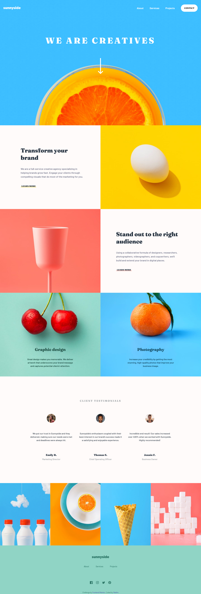

# Frontend Mentor - Sunnyside agency landing page solution

This is a solution to the [Sunnyside agency landing page challenge on Frontend Mentor](https://www.frontendmentor.io/challenges/sunnyside-agency-landing-page-7yVs3B6ef). Frontend Mentor challenges help you improve your coding skills by building realistic projects.

## Table of contents

- [Frontend Mentor - Sunnyside agency landing page solution](#frontend-mentor---sunnyside-agency-landing-page-solution)
  - [Table of contents](#table-of-contents)
  - [Overview](#overview)
    - [The challenge](#the-challenge)
    - [Screenshot](#screenshot)
    - [Links](#links)
  - [My process](#my-process)
    - [Built with](#built-with)
  - [Author](#author)

## Overview

### The challenge

Users should be able to:

- View the optimal layout for the site depending on their device's screen size
- See hover states for all interactive elements on the page

### Screenshot

### Links

- Solution URL: [github.com/nadimalid/sunnyside-agency-landingpage](https://github.com/nadimalid/sunnyside-agency-landingpage)
- Live Site URL: [nadimalid.github.io/sunnyside-agency-landingpage](https://nadimalid.github.io/sunnyside-agency-landingpage)

## My process

### Built with

- Semantic HTML5 markup
- Flexbox
- CSS Grid
- [tailwindcss](https://tailwindcss.com/) - CSS Framework
- [Astro](https://astro.build/) - JS Framework

## Author

- Github - [nadimalid](https://github.com/nadimalid)
- Frontend Mentor - [@nadimalid](https://www.frontendmentor.io/profile/nadimalid)

